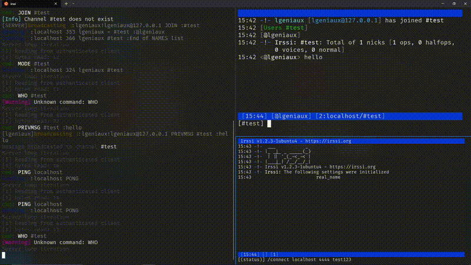

# 🌐 ft_irc - RFC2812 Compliant IRC Server


> A sophisticated Internet Relay Chat (IRC) server implementation in C++98, featuring advanced network programming, comprehensive protocol compliance, and production-quality architecture.



## ✨ Technical Highlights

### 🚀 Advanced Network Programming
- **Non-blocking I/O** with `select()` multiplexing for scalable concurrent client handling
- **Socket programming** with proper error handling and resource management
- **Persistent connection management** with graceful cleanup and disconnect detection
- **Partial command buffering** for robust network packet handling

### 🔐 Security & Access Control
- **Multi-stage authentication** (PASS → NICK → USER) with state validation
- **Channel operator system** with elevated privileges
- **Comprehensive channel modes**: `+i` (invite-only), `+t` (topic protection), `+k` (key), `+o` (operator), `+l` (limit)
- **Invite-only channel management** with sophisticated access control

### ⚡ Protocol Implementation
- **Full RFC2812 compliance** with proper IRC message formatting
- **Complete numeric response codes** (401, 403, 431, 432, 433, 442, etc.)
- **Hostmask implementation** (`nick!user@host`) in all messages
- **Multi-channel operations** with comma-separated JOIN commands

## 🎯 Core Features

### IRC Commands Implemented
| Command | Description | Advanced Features |
|---------|-------------|-------------------|
| `PASS` | Server authentication | Password validation |
| `NICK` | Nickname management | Conflict resolution with auto-modification |
| `USER` | User registration | Complete userinfo handling |
| `JOIN` | Channel joining | Multi-channel, key support, mode checking |
| `PART` | Channel leaving | Multi-channel departure |
| `PRIVMSG` | Messaging | Channel and private messages |
| `TOPIC` | Topic management | Operator restrictions, timestamps |
| `MODE` | Channel/user modes | All 5 IRC modes implemented |
| `KICK` | User removal | Operator privilege checking |
| `INVITE` | User invitation | Invite-only channel support |
| `QUIT` | Clean disconnection | Broadcast to common channels |

### Channel Management
- 🏗️ **Dynamic channel creation** - Channels created on first JOIN
- 👑 **Automatic operator assignment** - First user becomes operator  
- 🧹 **Smart cleanup** - Empty channels automatically removed
- 📢 **Efficient broadcasting** - Optimized message distribution algorithms
- 🔄 **Nickname propagation** - Cross-channel nickname updates

## 🏗️ Architecture Overview

```
┌─────────────────┐    ┌─────────────────┐    ┌─────────────────┐
│     Server      │    │     Client      │    │    Channel      │
│   (Socket Mgmt) │◄──►│  (Auth State)   │◄──►│   (User Mgmt)   │
└─────────────────┘    └─────────────────┘    └─────────────────┘
         │                       │                       │
         ▼                       ▼                       ▼
┌─────────────────┐    ┌─────────────────┐    ┌─────────────────┐
│ CommandHandler  │    │ RFC2812Handler  │    │   Utilities     │
│ (Cmd Dispatch)  │    │ (Protocol Msgs) │    │  (Validation)   │
└─────────────────┘    └─────────────────┘    └─────────────────┘
```

### Key Design Patterns
- **Command Registry Pattern** - Modular command dispatch system
- **State Machine** - Client authentication flow management  
- **Observer Pattern** - Channel event broadcasting
- **RAII** - Resource management and cleanup

## 🚀 Quick Start

### Prerequisites
- C++ compiler with C++98 support
- Make build system
- Unix-like environment (Linux/macOS)

### Build & Run

```bash
# Clone and build
git clone https://github.com/lgeniaux/ft_irc
cd ft_irc
make

# Start the server
./ircserv <port> <password>

# Example
./ircserv 6667 mypassword
```

### Connect with irssi

```bash
# Install irssi (if needed)
sudo apt install irssi  # Ubuntu/Debian
brew install irssi      # macOS

# Connect to your server
irssi
/connect localhost 6667 mypassword
/join #general
/msg #general Hello from my IRC server!
```

## 🔧 Advanced Usage

### Multi-Channel Operations
```irc
/join #dev,#general,#random key1,key2
/part #dev,#general
/mode #channel +itk secretkey
```

### Channel Management
```irc
/invite friend #private-channel
/kick #channel troublemaker
/topic #channel New topic here
/mode #channel +o friend
```

## 💻 Technical Implementation

### Network Programming Approach
- **Single-threaded design** using `select()` for I/O multiplexing
- **Non-blocking sockets** to prevent server blocking on client operations
- **Event-driven architecture** for handling multiple simultaneous connections
- **Graceful error handling** with proper socket cleanup

### Memory Management
- **C++98 compliant** memory management without modern smart pointers
- **STL containers** for efficient data structure management
- **RAII principles** for automatic resource cleanup
- **No memory leaks** - comprehensive resource management

### Code Quality Features
- ✅ **Strict compilation** with `-Wall -Wextra -Werror`
- ✅ **Modular architecture** with clear separation of concerns
- ✅ **Comprehensive error handling** for network and protocol errors
- ✅ **Professional build system** with dependency tracking
- ✅ **Signal handling** for graceful server shutdown

## 📊 Performance Characteristics

- **Scalable**: Handles multiple concurrent clients efficiently
- **Low latency**: Direct message routing without unnecessary delays
- **Memory efficient**: Optimized data structures for minimal overhead
- **Robust**: Comprehensive error handling and recovery

## 🎓 Educational Value

This project demonstrates mastery of:
- **Systems Programming** - Low-level network programming in C++
- **Protocol Implementation** - Standards compliance and message formatting
- **Concurrent Programming** - Multi-client handling without threading
- **Software Architecture** - Clean, modular design patterns
- **Resource Management** - Memory and socket lifecycle management

## 🛠️ Development

### Project Structure
```
ft_irc/
├── src/
│   ├── Server.cpp          # Core server implementation
│   ├── Client.cpp          # Client state management
│   ├── Channel.cpp         # Channel operations
│   ├── RFC2812Handler.cpp  # Protocol compliance
│   └── commands/           # Individual IRC commands
├── include/                # Header files
└── Makefile               # Build configuration
```

### Build System
- **Hierarchical Makefiles** for modular compilation
- **Automatic dependency tracking** for efficient rebuilds
- **Colored output** for professional development experience

---

<div align="center">

**Built with ❤️ and lots of ☕ at École 42**

*Showcasing advanced C++ systems programming and network protocol implementation*

</div>